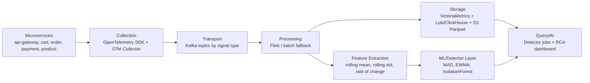
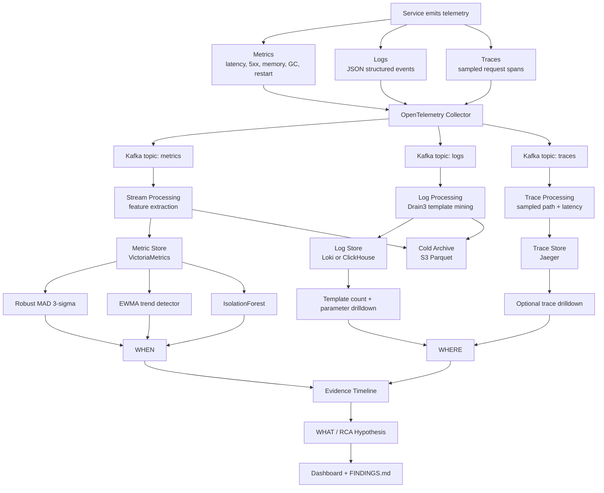

# AIOps Data Pipeline Architecture

## Use Case

Use case của nhóm: **incident detection and RCA for cart-service degradation in a microservice checkout flow**.

Mục tiêu của pipeline:

- Thu thập telemetry từ nhiều service.
- Detect anomaly trên metrics để trả lời **WHEN**.
- Mine log patterns quanh incident window để trả lời **WHERE**.
- Ghép evidence timeline để đưa ra **WHAT/root-cause hypothesis**.
- Sinh dashboard/report cho postmortem.

## Architecture From Lesson

Theo lesson W1-D3, observability data layer nên đi qua các stage:

```text
Service -> Collection -> Transport -> Processing -> Storage -> Query/AI
```

Thiết kế của nhóm mapping vào stage này như sau:



## Detailed Data Flow



## Component Choices

| Stage | Choice | Why this choice | Trade-off |
|---|---|---|---|
| Service instrumentation | OpenTelemetry SDK | Vendor-neutral, supports metrics/logs/traces, one standard across languages | Requires instrumentation effort |
| Collection | OTel Collector as gateway/daemonset | Central place to batch, enrich, filter, and route telemetry | Extra component to operate |
| Transport | Kafka | Decouples producers/consumers, supports replay, handles backpressure, allows multiple consumers | Adds latency and operational complexity |
| Metric processing | Flink for production, pandas batch for current lab | Flink supports stateful rolling windows at scale; current lab can simulate offline | Flink is heavier than needed for small/offline data |
| Log processing | Drain3 template parser | Groups dynamic raw logs into stable templates for RCA | Uses the actual `drain3` package with explicit masking instructions |
| Metric storage | VictoriaMetrics / Prometheus-compatible TSDB | Fast time-series query, lower cost than storing metrics in search DB | Less useful for raw event context |
| Log storage | Loki or ClickHouse | Loki is cheaper for label-first log search; ClickHouse is strong for aggregation | Elasticsearch gives richer full-text search but costs more |
| Trace storage | Jaeger with sampling | Useful for request path and bottleneck drilldown | Sampling can miss rare anomalies |
| Cold storage | S3/GCS + Parquet | Cheap long-term retention and training data source | Slower ad-hoc query than hot storage |
| Query/AI | Detector jobs + dashboard | Supports WHEN/WHERE/WHAT postmortem narrative | Offline dashboard is not a real-time alerting UI |

## Why Kafka Instead of Direct Push

Direct push is simpler, but production observability systems can burst heavily. If services push directly into storage, storage backpressure can cause dropped telemetry or unstable ingest.

Kafka is chosen because:

- It buffers telemetry when downstream storage slows down.
- It allows replay after detector or storage failure.
- It supports multiple consumers: dashboard, archive, detector, and RCA jobs.
- It decouples service deployment from analytics pipeline changes.

Trade-off:

- Latency increases by roughly `5-20 ms`.
- Kafka adds broker operations and monitoring cost.
- For a very small system with fewer than 10 services, Kafka may be overkill.

## Why OTel Collector

Services may be written in different languages and emit telemetry differently. OTel provides one standard format and collector path.

Benefits:

- One instrumentation standard for metrics, logs, and traces.
- Vendor-neutral output.
- Collector can enrich telemetry with service metadata.
- Collector can filter noisy logs such as health checks before storage.

## Processing Design

Processing has two modes:

### Current lab implementation

Current repo is offline/batch:

```text
CSV/JSONL files -> pandas processing -> CSV/PNG/HTML outputs
```

This is acceptable for the assignment because the objective is reproducible RCA.

### Production design

Production version would be streaming:

```text
Kafka -> Flink -> feature store / metric store / log store
```

Feature extraction examples:

- rolling mean
- rolling standard deviation
- rate of change
- error-rate delta
- template count per 5-minute bucket
- service-level anomaly score

## Storage Design

### Hot storage

Used for recent incident investigation.

- Metrics: VictoriaMetrics or Prometheus.
- Logs: Loki or ClickHouse.
- Traces: Jaeger.

Retention: around `7-30 days`.

### Cold storage

Used for historical analysis and ML training.

- S3/GCS/Azure Blob.
- Parquet format.

Retention: `months to years`.

Reason:

- Hot storage is fast but expensive.
- Cold object storage is cheap but slower.

## Query and AI Layer

Query/AI layer consumes processed telemetry and answers:

| Question | Data source | Method |
|---|---|---|
| WHEN did anomaly start? | Metrics | Robust MAD, EWMA, IsolationForest |
| WHERE is origin candidate? | Metrics + logs + optional traces | Service-level timeline and log template count |
| WHAT likely happened? | Evidence timeline | Root-cause hypothesis from ordered evidence |

Current detector choices:

- Robust MAD 3-sigma: primary, explainable, robust to skew.
- EWMA: trend support.
- IsolationForest: multivariate confirmation.
- Drain3 log templates: RCA explanation and log pattern count.

## Mapping to Current Repo

Current implementation is an offline version of the architecture:

| Production stage | Current repo implementation |
|---|---|
| Service | Raw files in `g1/metrics` and `g1/logs` |
| Collection | `load_metrics()` and `load_logs()` |
| Transport | File system acts as batch transport |
| Processing | `w1/lab/analyze.py` |
| Storage | CSV outputs in `outputs/` |
| Query/AI | Detector tables, charts, dashboard HTML |

Important files:

- `w1/lab/analyze.py`: pipeline implementation.
- `outputs/method_comparison.csv`: detector comparison.
- `outputs/detector_observability.csv`: threshold -> result -> interpretation.
- `outputs/log_templates.csv`: log template results.
- `outputs/incident_timeline.csv`: evidence ordering.
- `outputs/dashboard.html`: final postmortem dashboard.
- `outputs/realtime/events.jsonl`: simulated stream events from metrics and Drain3 log templates.
- `outputs/realtime/alerts.jsonl`: metric and log-template alerts emitted by the realtime replay.
- `outputs/realtime/rca_timeline.json`: rule-based RCA evidence chain.
- `outputs/realtime/rca_hypotheses.json`: ranked deterministic RCA hypotheses.
- `outputs/realtime/dashboard.html`: frontend dashboard built separately from the realtime data pipeline.

## Architecture Decisions

### Decision 1: Use robust MAD as primary detector

Context:

- EDA shows skewed metric distributions.
- Mean/std thresholds are sensitive to outliers.

Decision:

- Use robust MAD 3-sigma as primary detector.

Consequence:

- Threshold is explainable per metric.
- Better fit for right-skewed telemetry.
- May still produce false positives on noisy metrics, so persistence and timeline correlation are required.

### Decision 2: Use Kafka in production architecture

Context:

- Many services can emit telemetry at high rate.
- Storage may slow down or fail.

Decision:

- Put Kafka between collection and processing/storage.

Consequence:

- Replay and backpressure handling are available.
- Multiple consumers can read the same telemetry stream.
- Operational complexity increases.

### Decision 3: Use Drain3 parser in current lab

Context:

- Logs are structured enough for regex normalization.
- The repo should stay simple and offline.

Decision:

- Use the actual `drain3` package with configured similarity, tree depth, max children, numeric parameterization, and custom masks.

Consequence:

- No external dependency.
- Key template mining behavior is preserved for GC warning, cache eviction failure, OOMKilled, cart timeout, and cart 5xx.
- Because the pipeline now uses the actual library, docs and dashboards call this component Drain3.

## Cost and Scale Considerations

| Scale | Services | Log volume | Metric rate | Recommended approach |
|---|---:|---:|---:|---|
| Small | 10 | 50 GB/day | 100K events/sec | Managed SaaS or simple self-host stack; Kafka optional |
| Medium | 100 | 500 GB/day | 1M events/sec | OTel + Kafka + VictoriaMetrics + Loki/ClickHouse |
| Large | 1000 | 5 TB/day | 10M events/sec | Full streaming architecture, tiered storage, strict data contracts |

Cost drivers:

- Storage: GB stored * retention days.
- Ingest: events/sec or GB/day.
- Compute: stream processing CPU/RAM.
- Network: cross-zone or cross-region egress.

Cost optimizations:

- Filter noisy logs at collector.
- Sample traces.
- Use hot/warm/cold storage tiering.
- Store long-term history as Parquet in object storage.

## Data Contract and Schema

In production, schema drift can break the detector.

Recommended contract:

- Metrics must include `timestamp`, `service`, `metric_name`, `value`, and labels.
- Logs should be structured JSON with `timestamp`, `service`, `level`, `message`, `pod`, and optional error fields.
- Trace spans should include `trace_id`, `span_id`, `service`, `operation`, `duration_ms`, and status.

Architecture choice:

- Use schema registry or data contract once service count grows.
- For the current offline lab, CSV/JSONL schema is fixed and validated by the script.

## Final Summary

The designed architecture follows the lesson's data layer model:

```text
Service -> Collection -> Transport -> Processing -> Storage -> Query/AI
```

For this RCA project:

- Metrics are used to detect **WHEN**.
- Logs are used to explain **WHERE**.
- Evidence ordering is used to infer **WHAT**.
- Current repo is the offline/batch implementation.
- Production version would use OTel, Kafka, Flink, VictoriaMetrics/Loki, S3 Parquet, and dashboard/ML consumers.
