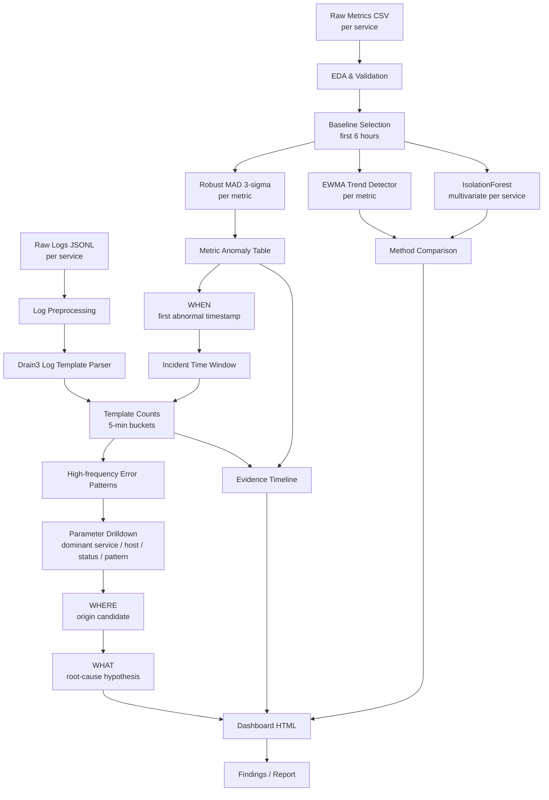

# Data Pipeline Presentation

## Goal

Pipeline được thiết kế để phục vụ postmortem/RCA offline. Mục tiêu là đi từ raw telemetry đến câu trả lời theo narrative:

```text
WHEN did the anomaly start?
WHERE did it originate?
WHAT is the likely root-cause mechanism?
```

Pipeline không chỉ tìm thời điểm alert. Nó cố gắng tìm tín hiệu bất thường sớm hơn alert, sau đó dùng logs để giải thích service origin và root-cause hypothesis.

## Pipeline Summary

This presentation should be read together with `ARCHITECTURE.md`, which contains the full data-layer design aligned with the W1-D3 lesson:

```text
Service -> Collection -> Transport -> Processing -> Storage -> Query/AI
```

```text
Raw metrics + raw logs
        ↓
EDA / data validation
        ↓
Detector calibration
        ↓
Anomaly detection: WHEN
        ↓
Log windowing + template mining: WHERE
        ↓
Root-cause hypothesis: WHAT
        ↓
Dashboard / findings
```

## Architecture Diagram

The diagram below is the analysis pipeline used by this repo. The production data-layer version is documented in `ARCHITECTURE.md`.



## Step 1: EDA

EDA được dùng để hiểu shape của data trước khi chọn detector.

Các việc chính:

- Validate row count, timestamp range, missing values, duplicate timestamps, timestamp gaps.
- Tính basic distribution statistics: min, p50, p95, p99, max.
- Tính skewness để xác định data có bị right-skewed không.
- Dùng ACF plot/check để xem có seasonal pattern rõ ràng không.

Kết luận EDA hiện tại:

- Data có right skew, nên mean/std dễ bị kéo lệch.
- Không thấy seasonal pattern đủ mạnh để cần seasonal decomposition.
- Vì vậy detector chính nên ưu tiên robust statistics.

## Step 2: Detect Anomaly - Answer WHEN

Mục tiêu của bước này là tìm thời điểm bất thường đầu tiên, không chỉ thời điểm alert.

### Baseline Choice

Pipeline dùng first 6 hours làm baseline cho metric detectors.

Lý do:

- Đây là khoảng trước main incident chain.
- Đủ sample để tính baseline median/MAD cho từng metric.
- Giúp detector có một normal reference window nhất quán.

Baseline này được dùng cho:

- Robust MAD 3-sigma.
- EWMA decision threshold.
- IsolationForest training.

Logs không dùng baseline 6 giờ theo cách này. Logs được parse template và dùng để hỗ trợ timeline/RCA.

### Robust MAD 3-sigma

Do skewness cao, pipeline dùng robust MAD thay vì classic mean/std.

Classic 3-sigma:

```text
threshold = mean + 3 * std
```

Robust MAD 3-sigma:

```text
MAD = median(|x - median(x)|)
sigma = 1.4826 * MAD
threshold = median + 3 * sigma
```

Architecture choice:

- Median ít bị ảnh hưởng bởi outlier hơn mean.
- MAD phù hợp hơn khi data bị right-skewed.
- Threshold explainable, dễ audit cho từng service/metric.

Result:

- Tạo bảng anomaly theo metric.
- Mỗi anomaly có timestamp, service, metric, value, baseline median, threshold, score.
- Dùng persistence rule để tránh spike đơn lẻ.

### EWMA Trend Detector

EWMA dùng để bắt trend bất thường, không thay thế MAD.

Decision logic:

```text
EWMA(span=20) > median + 3 * sigma
```

Trong đó median/sigma được tính trên EWMA series của first 6 hours.

Architecture choice:

- MAD bắt threshold crossing trên raw values.
- EWMA giúp nhìn drift/trend dần dần.
- EWMA hữu ích cho presentation vì chart thể hiện xu hướng rõ hơn.

### IsolationForest

IsolationForest được dùng cho multivariate detection per service.

Architecture choice:

- MAD/EWMA xét từng metric độc lập.
- IsolationForest xét nhiều metric cùng lúc để xem service có abnormal state không.
- Dùng như secondary confirmation vì score khó giải thích hơn threshold của MAD.

Training:

```text
train IsolationForest on first 6 hours per service
score full metric timeline
report first persistent anomaly after baseline
```

## Step 3: Use Anomaly Time to Find WHERE

Sau khi biết thời điểm bất thường đầu tiên, pipeline dùng thời điểm đó để giới hạn phạm vi log analysis.

Mục tiêu:

- Không đọc toàn bộ raw logs một cách thủ công.
- Tập trung vào window liên quan đến incident.
- Tìm log templates có count cao hoặc tăng mạnh quanh incident.

Log processing:

- Parse raw JSONL logs.
- Normalize dynamic values như IDs, numbers, status codes.
- Group similar messages into templates.
- Count template frequency by 5-minute buckets.

Ví dụ template quan trọng:

```text
GC overhead limit warning
ProductCatalogCache eviction failed
Container OOMKilled
Cart service timeout
Cart service returned 5xx
```

Architecture choice:

- Raw logs quá nhiều và có parameter động.
- Template mining giúp gom các log giống nhau thành pattern có thể đếm được.
- Count theo thời gian giúp phân biệt incident signal với isolated log line.

## Step 4: Drill Down Logs

Sau khi có template count, pipeline drill down để tìm pattern nào chiếm tỷ trọng lớn.

Các câu hỏi cần trả lời:

- Template nào xuất hiện nhiều nhất trong incident window?
- Template nào xuất hiện sớm nhất trước alert?
- Service nào sinh ra template đó?
- Có parameter nào dominant không, ví dụ host, status code, cache name, pod, hoặc error type?

Interpretation:

- Nếu cart-service có GC/cache/OOM pattern trước downstream errors, cart-service là origin candidate.
- Nếu order/payment/api-gateway chỉ có timeout/5xx sau cart failure, chúng là downstream symptoms.

## Step 5: WHAT - Root-Cause Hypothesis

Root cause không được kết luận từ một detector đơn lẻ. Pipeline dùng evidence ordering.

Current RCA chain:

```text
cart-service memory pressure
        ↓
JVM GC pause / GC overhead warning
        ↓
ProductCatalogCache eviction failure
        ↓
Container OOMKilled
        ↓
restart loop
        ↓
downstream timeout / 5xx in API gateway, order-service, payment-service
```

Architecture choice:

- Metrics answer WHEN.
- Log templates answer WHERE.
- Timeline ordering answers WHAT.

## Main Architecture Choices

These choices follow the lesson's architecture framing:

- **Collection**: OpenTelemetry SDK/Collector in production; local file loading in this offline lab.
- **Transport**: Kafka in production; local files as batch transport in this repo.
- **Processing**: Flink/streaming in production; pandas batch processing in `w1/lab/analyze.py`.
- **Storage**: VictoriaMetrics/Loki/S3 in production; CSV/PNG/HTML artifacts in `outputs/`.
- **Query/AI**: detector jobs and RCA dashboard.

### 1. Offline pipeline

Chọn offline pipeline vì đây là bài postmortem/RCA, không phải realtime alerting.

Benefits:

- Reproducible.
- Dễ review trong nhóm.
- Sinh được CSV, charts, dashboard HTML.
- Không cần external services/CDN.

### 2. Separate metrics and logs

Metrics và logs có vai trò khác nhau:

- Metrics: quantitative detection.
- Logs: qualitative explanation.

Vì vậy pipeline xử lý hai nhánh riêng rồi merge lại trong evidence timeline.

### 3. Robust detector as primary

Robust MAD được chọn làm primary detector vì data bị skewed.

Benefits:

- Explainable.
- Stable with outliers.
- Threshold rõ ràng.
- Mapping trực tiếp tới service/metric.

### 4. EWMA as trend support

EWMA được dùng để đọc trend, không phải detector chính duy nhất.

Benefits:

- Làm mượt noise.
- Giúp nhìn drift.
- Dễ giải thích trên chart.

### 5. IsolationForest as secondary confirmation

IsolationForest được dùng để confirm abnormality ở service-level.

Tradeoff:

- Mạnh hơn khi nhiều metric cùng lệch.
- Nhưng khó giải thích hơn MAD vì không có threshold đơn giản theo từng metric.

### 6. Log template mining

Template mining được chọn thay vì đọc raw logs thủ công.

Benefits:

- Giảm noise.
- Gom message tương tự.
- Đếm frequency theo thời gian.
- Giúp tìm pattern gây lỗi.

### 7. Evidence ordering over single signal

Pipeline ưu tiên thứ tự bằng chứng thay vì một anomaly đơn lẻ.

Reason:

- Một metric spike có thể là noise.
- Một log warning có thể xuất hiện trong normal operation.
- RCA mạnh hơn khi nhiều tín hiệu khớp theo đúng thứ tự thời gian.

## One-Slide Summary

```text
Architecture choice:
Use metrics for detection, logs for explanation, and timeline ordering for RCA.

Why:
- Metrics answer WHEN.
- Log templates answer WHERE.
- Evidence sequence answers WHAT.

Main design:
- First 6h baseline
- Robust MAD as primary detector
- EWMA for trend
- IsolationForest for multivariate confirmation
- Log template mining inside incident window
- Final dashboard as postmortem narrative
```

## Mapping to Project Outputs

- `outputs/eda_summary.csv`: EDA and validation summary.
- `outputs/method_comparison.csv`: detector comparison.
- `outputs/detector_observability.csv`: threshold -> result -> interpretation for MAD/EWMA.
- `outputs/anomalies_metrics.csv`: metric anomalies from robust MAD.
- `outputs/log_templates.csv`: parsed log templates.
- `outputs/log_template_timeseries.csv`: template counts by 5-minute buckets.
- `outputs/incident_timeline.csv`: merged evidence timeline.
- `outputs/dashboard.html`: final postmortem dashboard.
- `FINDINGS.md`: written RCA summary.
